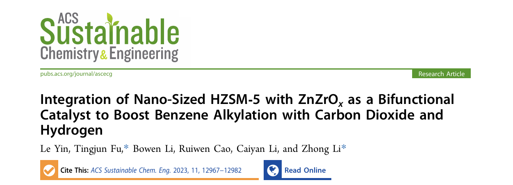
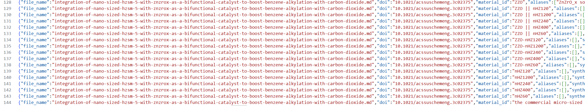
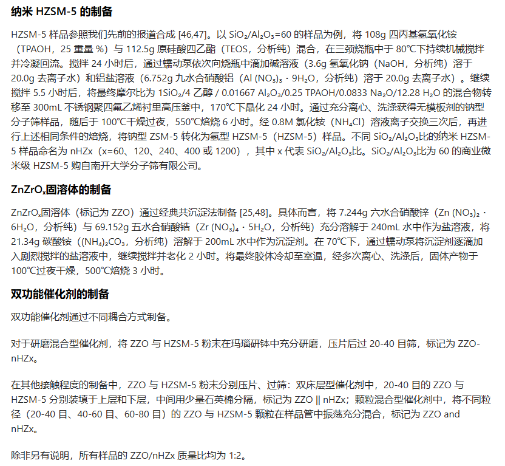
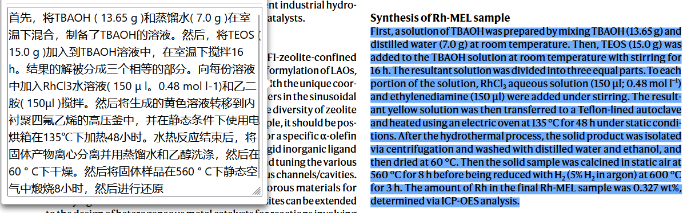
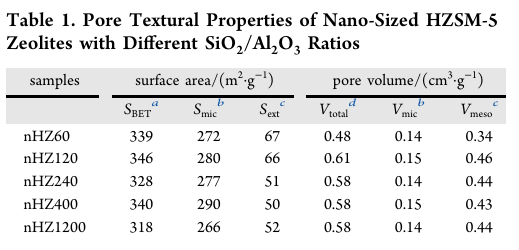
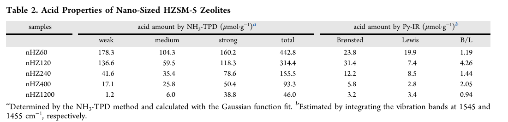

**针对存在大量凝胶组成为null的数据，我随便找了一篇核验：**

**对应数据128~144：**

**原文实验部分翻译：**

**针对："gel\_composition":"1SiO2/4EtOH/0.01667Al2O3/0.25TPAOH/0.0833Na2O/12.28H2O"**

**因为文中说明了凝胶组成的区别，既然文中给出了SiO2/Al2O3比为60的，您们应该设计方案，把其他的SiO2/Al2O3比的凝胶组成也给出来（这点我的问题，针对这种情况，应该设计推理环节）**

**比如SiO2/Al2O3比为120：**

**"gel\_composition":"1SiO2/4EtOH/0.00833Al2O3/0.25TPAOH/0.0833Na2O/12.28H2O"**

**但这里需要注意一点：有的文中的说法是SiO2/Al2O3比，有的是Si/Al比，这两个是有差别的，SiO2/Al2O3 = Si/Al \* (1/2)**

**在有些文献中可能没有给出标准的凝胶组成（也就是上述的比例），而是给出实际合成步骤，比如加入XX多少g，加入XX多少ml之类的具体数字，而不是一个整合后凝胶组成比例，如下图所示：**

**对于这种情况，凝胶组成部分就改成具体的原料以及用量：**

**如：**

**XXX：xx g**

**XXX: xx ml**

**然后针对：**

**{"bronsted\_acid\_amount\_mmol\_g":0.0314,"lewis\_acid\_amount\_mmol\_g":0.0074,"l\_b\_ratio":0.236}**

**这部分，似乎文献中都是计算B/L，而不是我给的l\_b\_ratio，干脆后续提取就都改成B/L吧**

